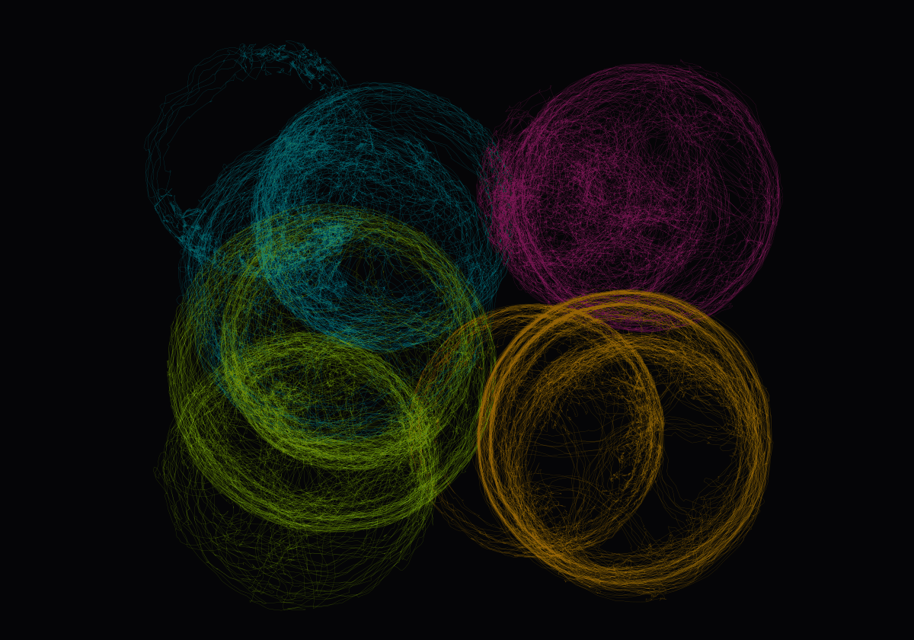

# NMR_spontaneous_behavior

Analysis code and associated data for Haba et al. (2026) *Spontaneous behavior predicts colony membership, individual identity, and rank in naked mole-rat societies* (*bioRxiv*, [doi:10.64898/2026.09.27.754730](https://doi.org/10.64898/2026.09.27.754730)).


*Artwork — randomly overlaid keypoint traces of naked mole-rat spontaneous behavior, each colony in a different color.*

## Structure

```
├── README.md
├── LICENSE
├── data/                            # summary data (CSV)
├── config/kpms_config.yml           # Keypoint-MoSeq settings
├── environment/
│   ├── environment-macos.yml        # analysis (scripts 02–09)
│   └── environment-hpc-kpms.txt     # Keypoint-MoSeq GPU environment (script 01)
└── scripts/
    ├── README.md                    # inputs and order
    ├── utils.py                     # shared helpers
    ├── 01_fit_kpms.py               # Keypoint-MoSeq fitting and model selection
    ├── 02_syllable_features.py      # per-animal syllable features, family transitions
    ├── 03_umap.py                   # UMAP of syllable instances
    ├── 04_colony_prediction.py      # colony membership
    ├── 05_identity_prediction.py    # individual identity
    ├── 06_sex_status_prediction.py  # sex and reproductive status
    ├── 07_dominance_rank.py         # Bradley–Terry ranks, transitivity, rank stability
    ├── 08_rank_prediction.py        # rank prediction within and across colonies
    └── XX_sampling_simulation.py    # dyad and trial subsampling used to design tube testing
```

## Pipeline

1. **Pose estimation** — SLEAP
2. **Behavioral syllables** — `01_fit_kpms.py`
3. **Syllable features and embedding** — `02_syllable_features.py`, `03_umap.py`
4. **Colony, identity, sex and status prediction** — `04`–`06`
5. **Dominance rank** — `07_dominance_rank.py` (tube-test design: `XX_sampling_simulation.py`)
6. **Rank prediction** — `08_rank_prediction.py`

## Software

SLEAP; Keypoint-MoSeq; Python 3.11 with NumPy, pandas, SciPy, scikit-learn, h5py, umap-learn (see `environment/`).

## Data

Data underlying the figures are in `data/`.

## Citation

Haba Y, Schwark R, Weinreb C, Ogundare S, Foster W, Tsai Y-YW, Lyu J, Mohamed M, Chang P, Arnold A, Schaffer E, Rajan K, Datta SR, Abdus-Saboor I. (2026). Spontaneous behavior predicts colony membership, individual identity, and rank in naked mole-rat societies. *bioRxiv*. [https://doi.org/10.64898/2026.09.27.754730](https://doi.org/10.64898/2026.09.27.754730)

## Contact

Yuki Haba, Ph.D. — yh2778[at]columbia.edu

Ishmail Abdus-Saboor, Ph.D. — ia2458[at]columbia.edu

## License

MIT; see [LICENSE](LICENSE).
